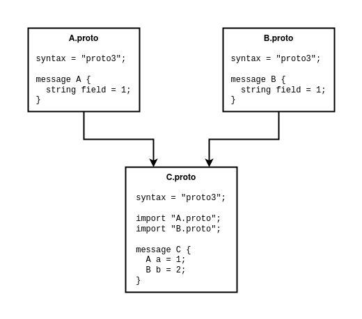
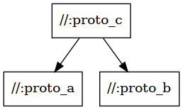

# Protobuf and gRPC with Bazel

The use of [Protobuf](https://developers.google.com/protocol-buffers) and
[gRPC](https://grpc.io) with [Bazel](https://bazel.build) is a particularly common scenario, since
these three technologies provide a complimentary base of build, serialization and remote-call upon
which to build complex systems and products. This document summarizes the current state of the
Protobuf/gRPC Bazel ecosystem and gives advice on getting started when you are looking to integrate
one of these tools into your project.

Given that all three of Bazel, gRPC and Protobuf are Google-derived projects, you may expect that
there is a simple integration between them. However, the existence of this document should indicate
that there is not a single simple answer to integrating these tools. Originally, Protobuf and gRPC
rules were baked into Bazel for a few key languages, but this has understandably not continued to
scale with the many new languages that are now supported in external Bazel rulesets. As a result,
independent rulesets have been released by the community that provide the integrations necessary to
convert `.proto` files into a wide variety of languages and libraries.

This page is expected to continue as a 'live' document; as the ecosystem evolves and new rulesets
are released, this document can be edited at
[SIG-rules-authors](https://github.com/bazel-contrib/SIG-rules-authors/tree/gh-pages) to continue to
reflect today's state.


## The Basics

At its most basic level, the task of working with Protobuf and gRPC `.proto` files is much the same
as outside of Bazel: we execute the Protobuf Compiler `protoc` with the necessary arguments,
environment and plugins to get it to produce a desired set of files or libraries for any specific
language. For those unfamiliar with `protoc`, it is a small compiler executable that parses sets of
`.proto` files and executes plugins to write a set of output source code files. These
files implement the interfaces for working with the messages and services in the language supported
by the plugin.

However, given the prevalence of Protobuf and gRPC use, users are not expected to reinvent the rules
needed for calling protoc themselves. Instead, the common base dependency ruleset
[bazelbuild/rules_proto](https://github.com/bazelbuild/rules_proto) provides the `proto_library`
rule which can be used to establish libraries of `.proto` files and map their dependencies. For
example, suppose we have the following dependency tree of `.proto` files:



For this set of files, we could define the following collection of `proto_library` targets. Note
that some rulesets introduced later, such as stackb/rules_proto and rules_go, provide tooling
through Gazelle for auto-generating these `proto_library` from the `.proto` files.

```starlark
load("@rules_proto//proto:defs.bzl", "proto_library")

proto_library(
  name = "proto_a",
  srcs = ["A.proto"],
)

proto_library(
  name = "proto_b",
  srcs = ["B.proto"],
)

proto_library(
  name = "proto_c",
  srcs = ["C.proto"],
  deps = [":proto_a", ":proto_b"], # Provides the depended files when calling protoc
)
```

Using `bazel query`, we can view the graph that Bazel has assembled from the targets, showing it
correctly reflects the dependency of `proto_c` on `proto_a` and `proto_b` (you must have
`dot` from [Graphviz](https://graphviz.org/) installed):

`bazel query --output graph --nograph:factored 'kind(proto_library, //...)'  | dot -Tpng > graph.png`




Note that we could have grouped all of these `.proto` files under a single `proto_library` in this
particular case. In real codebases these files may be under separate directories and managed by
different groups or companies. The convention for splitting or grouping libraries varies by target
language, but for most it is a matter of local preference. However, for some languages, files with
the same internal [`package`](https://developers.google.com/protocol-buffers/docs/proto3#packages)
specifier should normally be grouped into a single library. In general, you should be
consistent with your grouping conventions within your workspace.

At this point we have defined the abstract collections of `.proto` files, but these targets alone
do not provide the source code artifacts to interact with the messages and services within our code,
since we have not given protoc any plugins or target languages. Therefore, we need to introduce
rulesets that can consume these targets and provide the language-specific plugins and knowledge to
produce libraries.


## The Ruleset Options

Within the Bazel ecosystem, there are three main types of rulesets to consider when using Protobuf
or gRPC:

- **Canonical Dependencies**: The [Protobuf](https://github.com/protocolbuffers/protobuf/) and
  [gRPC](https://github.com/grpc/grpc) source repositories contain a minimal selection of rules for
  their key languages (C++, Python). These rules benefit from needing no further dependencies
  beyond the basic repos. However, they are also mostly undocumented and not typically not well
  supported.

- **Cross-Language Rulesets**: There are two main multi-language rulesets available:
  [rules_proto_grpc](https://github.com/rules-proto-grpc/rules_proto_grpc) and
  [stackb/rules_proto](https://github.com/stackb/rules_proto). These rulesets provide a common rule
  interface to produce assets from `.proto` files across a wide variety of supported languages. The
  difference between the two is in how the rules assemble their targets and actions, with
  rules_proto using [Gazelle](https://github.com/bazelbuild/bazel-gazelle) to capture some of the
  more difficult behaviours of plugins.

- **Language-Specific Rulesets**: Finally we have the language-specific rulesets, which may
  introduce their own specialized rules for supported language, such as seen in
  [rules_go](https://github.com/bazelbuild/rules_go#protobuf-and-grpc). The benefit of these rules
  is that they are designed and supported around the needs of the specific language involved and
  benefit from the expertise of the rules authors. However, in any multi-language project, this may
  require using multiple varieties of rules with different behaviours.

You may be left asking why there is no single ruleset that encompasses all requirements for Protobuf
and gRPC, but unfortunately there are a number of tradeoffs inherent to each of these rulesets,
which we will explore later.

The full list of available rulesets has been compiled in the table below, showing the languages
supported by each. If you know of a ruleset not shown in this list, please open an issue
[here](https://github.com/bazel-contrib/SIG-rules-authors/issues).

<iframe src="https://docs.google.com/spreadsheets/d/e/2PACX-1vTiSt_QqCX1BHHf5BQZp5niRdBPwXbCn9TlpBwJrBRGEscZ75fQE8J4jupOMHu61uoAerUJsyXrCtDc/pubhtml?gid=0&amp;single=true&amp;widget=true&amp;headers=false" style="width: 100%; height: 400px"></iframe>


## Picking a Ruleset

Given the above options of rulesets, it may appear difficult to select which to use when introducing
Protobuf or gRPC to a project. However, the selection essentially comes down to a process of
elemination through three steps. As a prerequisite for these steps, you should consider the
languages you currently need to support within your project and any you may expect to support in the
near future, as this dictates the majority of the choices:

1. In the event you are using only C++ and/or Python, consider using the rules provided in the
   canonical dependency repositories above. Despite their lack of documentation, they generally work
   acceptably for simple use-cases and benefit from not pulling in any further rule dependencies.
   Simplicity is your friend in this case.

2. If you have a single required language (or a low but manageable number), consider using the
   language-specific rulesets if they are available and suitably documented. As mentioned before,
   these rulesets benefit from being tailored to the language requirements and you will likely be
   pulling these rulesets into your workspace already.

3. If you have multiple supported languages or languages that do not have language-specific
   proto/gRPC rules, consider using one of the two cross-language rulesets listed above. In this
   case, you will benefit from the common rule interface and behaviour between your languages.
   Choosing between the two rulesets will effectively come down to your preference for using
   Gazelle within your project and the languages supported by each.


## In Depth

Given the above variety of options and rulesets, it is useful to explore why the ecosystem appears
so fragmented and what makes this a more difficult problem that it may at first seem.

At the top-level, all of these rulesets depend on the
[bazelbuild/rules_proto](https://github.com/bazelbuild/rules_proto) ruleset described previously,
which introduces the `proto_library` language-agnostic rule, which collects a set of `.proto` files
and transforms them to a set of
[descriptors](https://developers.google.com/protocol-buffers/docs/reference/cpp/google.protobuf.descriptor)
and [ProtoInfo providers](https://docs.bazel.build/versions/main/skylark/lib/ProtoInfo.html)
that other rules can use to drive protoc.

However, the complications on top of this process come in four main varieties:

- **Plugin Output Predictability**: Predictability in the context of a protoc plugin is used to mean
  that the outputs produced are stably definable purely from the input `.proto` file names and the
  plugin options. Under this definition, all of the core languages supported by the canonical
  Protobuf and gRPC implementations are considered predictable. However, a number of third-party
  plugins for other languages become non-predictable when dealing with gRPC and services; the most
  commonly observed behaviour is that they will produce output files named by the services *within*
  the `.proto` files. On the extreme end, there are some plugins that produce *no* outputs and are
  expected to be executed as tests, such as for validation.

  This non-predictability is a challenge for Bazel, which expects to be able to assemble the full
  graph of files and targets without having to read the contents of any of the source files.
  Resolving this behaviour into a structure that can work under Bazel leads to a large part of the
  variation between rulesets. At a basic level, a number of these plugins can be manipulated into a
  predictable behaviour through options and post-processing, or the use of
  [declare_directory](https://docs.bazel.build/versions/main/skylark/lib/actions.html#declare_directory)
  to capture the full output tree without knowing its structure ahead of time.

  However, some plugins are sufficiently odd that the above process is unsuitable or unable to
  capture the behaviour; this is where [stackb/rules_proto](https://github.com/stackb/rules_proto)
  introduces a [Gazelle](https://github.com/bazelbuild/bazel-gazelle) plugin, which directly parses
  the `.proto` files, captures any of the plugin behaviour in Go functions and produces `BUILD`
  files that satisfy all of Bazel's requirements.

- **Plugin Configurability**: Many protoc plugins have a high degree of configurability, with
  options that may radically alter the outputs and the behaviour of the generated code. As such,
  supporting the full range of options can be a challenge to wrap in a sensible Starlark rule API.
  Generally, options that only alter the output file content are well supported across rulesets,
  with mechanisms for injecting and manipulating these options in the rules. However, options that
  alter the output directory layout may trigger the output predictability issue above, with a
  similar conclusion regarding the introduction of Gazelle.

- **Cross-Cutting**: Rulesets that support Protobuf and gRPC need to know about both protoc
  execution and about the target languages for which the plugins are generating files. This requires
  the authors of such rulesets to have expertise in every language that they hope to support, whilst
  also having expertise in how protoc itself works, which narrows the pool of people interested in
  tackling this.

- **Dependencies**: Due to the above cross-cutting nature, a ruleset that supports many languages
  also ends up with many dependencies, on both other rulesets and on Protobuf/gRPC implementations.
  Due to how dependencies currently work with Bazel workspaces, this typically results in users
  stuck with a Protobuf/gRPC version dictated by their choice of rulesets, unless they are
  comfortable overriding dependencies. This also makes maintenance of these rulesets more
  challenging, since rules authors must keep on top of updates to their upstream dependencies.

  The introduction of [bzlmod](https://docs.bazel.build/versions/main/bzlmod.html) to Bazel 
  (expected in version 6, but testable with an experimental flag in version 5) will hopefully
  resolve many of the dependency issues listed above and in doing so remove workload from rules
  authors and allow rules users more freedom to choose versions. Under bzlmod, the dependency tree
  is explicitly managed by the end user, with updates to transitive dependencies handled
  transparently without updates needed to intermidiary rulesets.

The above four points dictate much of fragmentation seen between rulesets, since there are numerous
solutions to these problems, each with their own tradeoffs. The solution that works well for one
language may be less suitable for another, leading to naturally diverging behaviour. As such,
hopefully it is now slightly cleared why there is such a diversity of Protobuf and gRPC rulesets,
with no single 'right answer' that solves everyones' problems.


## Custom Plugins

Once you've got Protobuf and gRPC fully integrated with your project and workspace, you may then
find yourself wanting to use a custom protoc plugin that is either closed source or is otherwise
unsupported by any of the available rulesets. In these cases, rather than completely reinvent the
protoc calling conventions in your own rules, both of the cross-language rulesets linked above
provide mechanisms for integrating your plugin with their standard calling convention.

With stackb/rules_proto, you can
[extend the Gazelle plugin](https://github.com/stackb/rules_proto/tree/master/pkg/plugin) to support
your custom plugin's, by capturing its full behaviour in a few Go functions. With rules_proto_grpc,
you can
[define your own](https://rules-proto-grpc.com/en/latest/custom_plugins.html) `proto_plugin` and the
supporting compilation rules.

There are situations in which these tools are insufficient for a specific plugin, but many of the
more standard use-cases will be supported here.


## Common Issues

When working with Protobuf and gRPC under Bazel, there are some issues that are widely seen by many
users:

- **Caching**: The way Protobuf is built with Bazel is incredibly fragile to cache misses, leading
  to frequent rebuilds of protoc for no clear reason. This issue is particularly prevalent on CI
  systems, where getting protoc to cache is particularly challenging. There is no clear single
  cause for this behaviour, since apparently identical environments may still miss the cache.

  This has led to protoc being downloaded as a prebuilt binary in bazelbuild/rules_proto, but this
  mechanism breaks when a user wants to use a different protobuf version.

- **Python Toolchains & gRPC**: The Bazel build of gRPC bypasses the Python toolchains defined
  through the Python rules in rules_python. Under normal circumstances (a single system Python),
  this happens to resolve consistently. However, when a custom Python toolchain is used or the
  system has a more complex Python setup, the gRPC build may resolve the incorrect Python version.
  This may result in a Python extension that is incompatible with the target Python.


## Resources and Further Reading

For further detail on some of these topics, please consider looking at the following:

- [Protocol Buffers in Bazel](https://blog.bazel.build/2017/02/27/protocol-buffers.html): Blog post
  from the Bazel Blog which covers some more of the basics of getting started with Protobuf and
  gRPC under Bazel.

- [BazelCon 2021 BOF BUILD File Generation - Automating Protocol Buffer Rules with Gazelle](https://www.youtube.com/watch?v=QnFkgHxM5oU):
  The recording of a presentation from BazelCon 2021 on how stackb/rules_proto uses Gazelle to
  solve the plugin output predictability problem.

- [History](https://github.com/stackb/rules_proto#history): A history of the origins and differences
  between the two cross-language rulesets.
